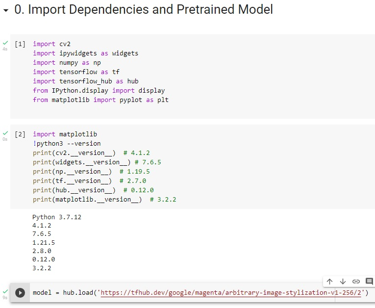
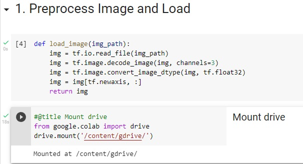
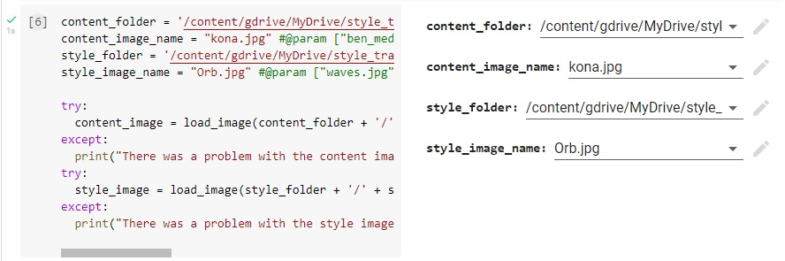
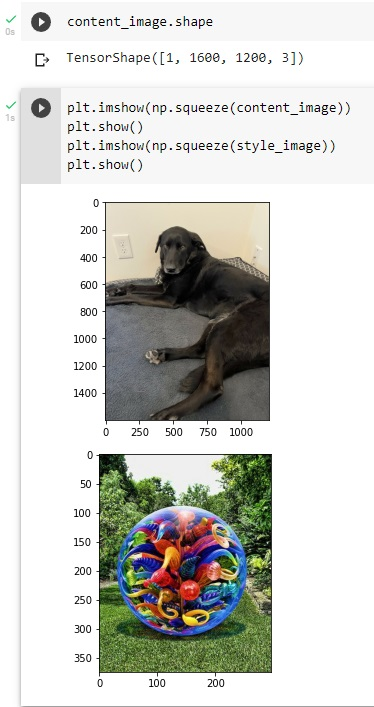
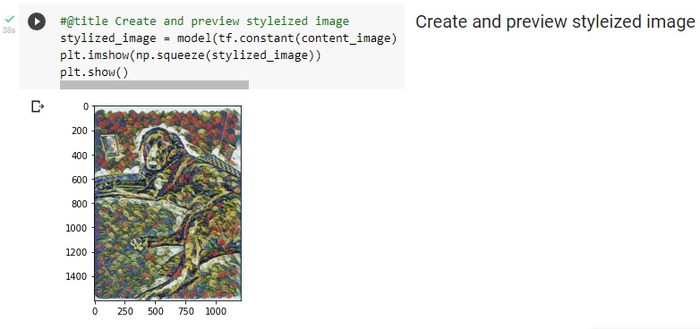
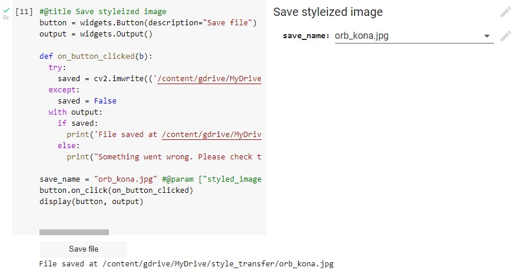
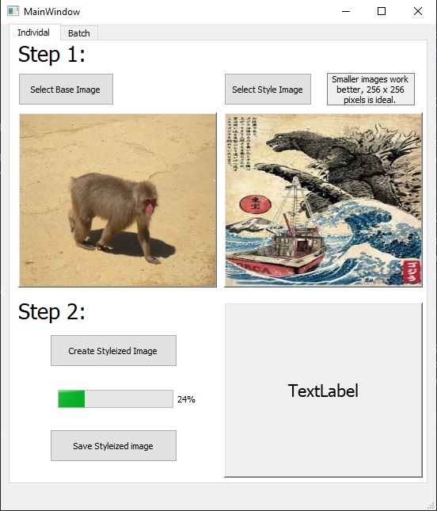

# neural_style_transfer
 
A user friendly neural style transfer project.
 
1. [Description](#description)
2. [Instructions](#instructions)
    1. [Colab](#colab)
    2. [Script](#script)
3. [Author](#author)
 
 
## Description
 
Neural style transfer uses neural networks to take the style of an image and apply it to another image. I started this project to create an image for a custom birthday card for a friend. After the reception it received, I have endeavored to transform the original google colab notebook into an application that could be used locally by anyone.
 
---
 
## Instructions
 
Instructions for how to use the notebook on google colab with your google drive, and for how to use the python script on your local device.
 
---
 
### Colab
 
---
 
####  Step 1:
 
After opening the notebook in google colab, run all of the cells under the heading "0. Import Dependencies and Pretrained Model" and check that all of the version numbers match the numbers specified in green. If one of them does not, reinstall the package by opening up the first cell, adding the following code before the imports, running the cell, then clicking the button to restart the runtime when it appears. After the runtime has restarted, you may remove or comment out the code before running all of them again.
 
```
!pip install package_name=version_number --force-reinstall
```
If everything went successfully, you should have green checkmarks and the time it took to run each cell showing. It will look like this:
 

 
 
### Step 2:
 
Now move on to the next section "1. Preprocess Image and Load". We are now going to run the first cell to get the image processed and loaded for our model. Then the second cell will mount your google drive onto the session at the location /content/gdrive/ allowing you to access your google drive content from /content/gdrive/MyDrive/. Not that a popup window will appear asking you to allow access to a google drive account. When the output of the second cell says "Mounted at /content/gdrive/" you are able to move on to the next step.
 

 
### Step 3:
 
Now is the time to select both the image you wish to apply the style to (content) and the image whose style you wish to use (style). Using the entry fields on the right, fill out the full file path to the folder each image is in, and the name of the image file with extension. If there is an output indicating a problem with either the content or style image, please double check that the file is an image file, that you have included the extension, the folder location is correct, and that there are no spelling mistakes.
 
NOTE: Smaller style images tend to work better, the model was originally trained on a 256x256 pixel image.
 

 
### Step 4:
 
The next section "2. Visualize Output" is there to verify the images loaded correctly and show you their sizes. The first cell should output TensorShape([1, content_image_height, content_image_width, 3]). The second cell should show both the content image and style image you have selected as well as their size. If on of the images is incorrect, please go back to step 3 and check that it has completed without issue.
 

 
### Step 5:
 
Now we are finally going to create your brand new image! Run the first cell in "3. Stylize Image". If your images are large, the time it takes to finish could be around 5 minutes. The images used for the demonstration only took just under 40 seconds to complete. You should see a preview of the image and its size, which should match the original content images size.
 

 
### Step 6:
 
To save the image you have created, fill out the form on the right with the name for the file you wish to save it to with the appropriate extension. Then run the cell, A save button should appear at the bottom and when clicked, will indicate if the save was successful or not.
 
If you wish to try out a new combination or create another image, you must run the cells in [Step 3](#step-3), [Step 5](#step-5), and [Step 6](#step-6) again in order to save the new image. It is also worth using [Step 4](#step-4) to check that the images have changed, but not necessary.
 

 
---
 
### Script
 
---
 
The python script version is currently suffering from hardware limitations. Especially if the user does not have a GPU configured to run with tensorflow, the processing requirements cause tensorflow to abort the process of creating the stylized image to prevent the execution from interfering with the operation of the CPU. I am currently searching for a way to alter the execution of the model in a way that will lower the processing requirements, even though it will probably extend the time required greatly. Here is a preview of the GUI I have designed so far. Please note that the progress bar and batch version, are stretch goals and no code has been written as of yet to implement them.
 

 
---
 
## Author
 
[Benjamin Dosch](https://github.com/BenDoschGit)
 